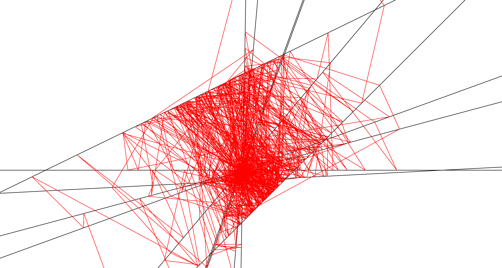
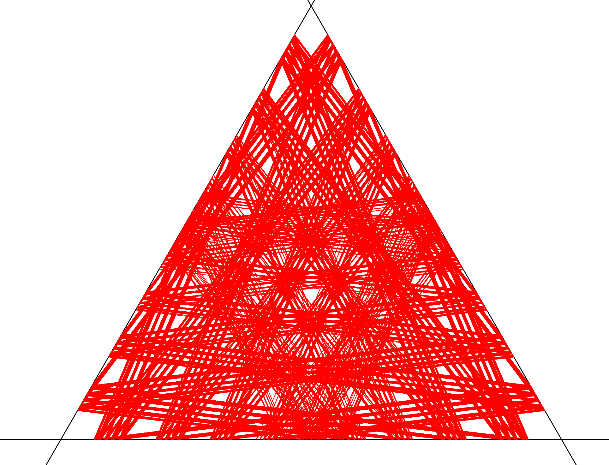

# N-Rule-Maps
This repository provides the code for implementing n-rule maps over the general space of intersecting lines on the plane.  The behavior of n-rule maps in such spaces is generally quite robust, and this software provides a platform on which to experiment with n-rule maps in a general way; the user can specify any space and n-rule map and use this software to determine the behavior of the n-rule map over the space through studying orbit data and plots.

Examples of periodic orbits generated by n-rule maps in different spaces are provided in the following images.

## Documentation and Examples.
For general background into n-rule maps, documentation for code use and examples see the `N-Rule Maps.ipynb` notebook.

### Dependencies
Running this n-rule maps program requires Python 3.x, the Python Math and Random packages, Matplotlib, and NumPy.
